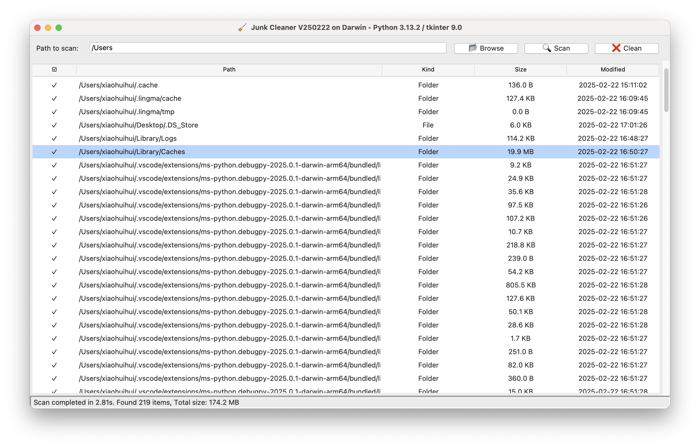
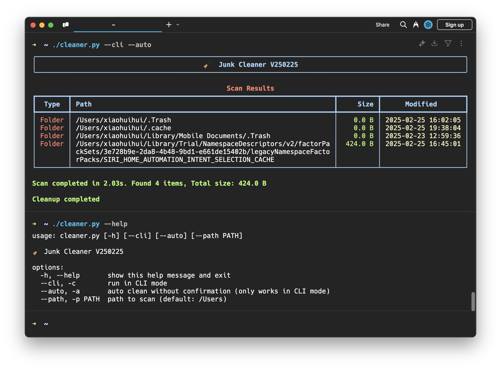

# 🧹 Junk Cleaner / 垃圾文件清理工具

<div align="center">
  
  
</div>

<p align="center">
A simple and efficient tool for scanning and cleaning system junk files.<br>
一个简单高效的系统垃圾文件扫描清理工具。
</p>

<p align="center">
  
  
</p>

## ✨ Features / 功能特点

- 🖥️ GUI and CLI modes / 支持图形界面和命令行两种模式
- ⚡ Fast scanning with multi-threading / 多线程快速扫描
- 🔍 Sort and filter scan results / 可排序和筛选扫描结果
- 🎯 Interactive selection for cleanup / 交互式选择要清理的文件
- 💻 Support for macOS/Windows/Linux / 支持 macOS/Windows/Linux
- 🔒 Safe cleanup with confirmation / 安全清理需确认
- 📊 Detailed scanning statistics / 详细的扫描统计

## 🚀 Quick Start / 快速开始

```shell
# Download & Install / 下载 & 安装
git clone https://github.com/roperescuer/junk-cleaner.git
cd junk-cleaner

# Set execution permissions / 设置运行权限
chmod +x cleaner.py

# Run in GUI mode / 以图形界面模式运行
./cleaner.py

# Run in CLI mode / 以命令行模式运行
./cleaner.py --cli

# Run with custom scan path / 指定扫描路径
./cleaner.py --path /path/to/scan

# Auto clean in CLI mode / CLI模式下自动清理
./cleaner.py --cli --auto
```

## 🔍 Supported Files / 支持清理的文件

### System Files / 系统文件
- 🗑️ `.DS_Store`, `desktop.ini`, `Thumbs.db`
- 📜 `.bash_history`, `.zsh_history`, `.viminfo`
- 📁 `.Trash`, `.Spotlight-V100`, `.fseventsd`

### Cache Files / 缓存文件
- 💾 Browser caches / 浏览器缓存
- 📦 Application caches / 应用程序缓存
- 🗃️ System caches / 系统缓存

### Temporary Files / 临时文件
- 📄 `.log`, `.tmp`, `.cache`, `.temp`
- 📂 Temporary folders / 临时文件夹

## ⌨️ Development Environment / 开发环境
- Apple Silicon M1
- macOS Sequoia 15.3.1
- Python 3.13.2
- Visual Studio Code

(Develop and fully test only on Mac / 仅在 Mac 上进行开发并充分测试)

## 📋 Prerequisites / 环境要求

- [Python 3.10+](https://www.python.org/downloads)
- [tkinter](https://www.python.org/downloads) (for GUI mode / GUI 模式需要)
- [rich](https://pypi.org/project/rich/) (for CLI mode / CLI 模式需要)

## 📝 Usage / 使用说明

### GUI Mode / 图形界面模式

1. Select path to scan / 选择要扫描的路径
2. Click "Scan" to start scanning / 点击"扫描"开始扫描
3. Select files to clean / 选择要清理的文件
4. Click "Clean" to remove selected files / 点击"清理"删除所选文件

### CLI Mode / 命令行模式

```shell
usage: cleaner.py [-h] [--cli] [--auto] [--path PATH]

🧹 Junk Cleaner - Ver.250220 Python: 3.13.2 Darwin

options:
  -h, --help             Show help / 显示帮助信息
  --cli, -c              Run in CLI mode / 使用命令行模式
  --auto, -a             Auto clean without confirmation / 自动清理无需确认
  --path PATH, -p PATH   Path to scan / 指定扫描路径
```

## ⚠️ Important Notes / 重要提示

- 🔐 Administrator Privileges: Administrative/root privileges are required to clean system files

    管理员权限：清理系统文件需要管理员/root权限

- 💾 Data Backup: Strongly recommend backing up important data before cleaning

    数据备份：清理前强烈建议备份重要数据

- ⚡ Performance Impact: Scanning process may temporarily affect system performance

    性能影响：扫描过程可能暂时影响系统性能

- 🛡️ Security: Do not delete system files that you are unsure about

    安全性：请勿删除不确定的系统文件

## ❤️ Special Thanks / 特别鸣谢

- GitHub Copliot Claude 3.5 Sonnet / AI代码大模型 Claude 3.5 Sonnet
